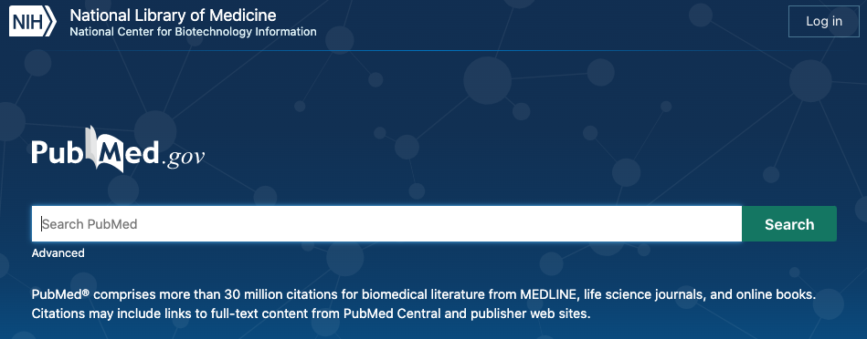

# Pubmed Parser
### Python-Based Scraper and Textual Analysis

Too many scientific articles to read, and not nearly enough time. 

As principle investigators expand their research programs across disciplines, and buzzwords make their way into more and more studies (see Pubmed query: 'Artificial Intelligence', 'Reinforcement Learning'), a big reason for the reading bottleneck is driven by the difficulty in setting a stricter primary filter to capture only research articles relevant to your studies. 

Here, we will scrape the publicly-available database Pubmed (though flexible to search any NCBI database) to analyze the language and structure around abstracts for peer-reviewed scientific articles. An advantage of this toolkit is that it allows for maximum search flexibility, using the same advanced query constructions as the NCBI database advanced search itself, allowing for cross-author and cross-domain investigations. The goal is to provide a tool that allows scientific researchers to investigate scientific literature with greater precision, by 1) narrowing the initial filter of papers that make it to your To-Do list and 2) generating digestable overview pages for subfields and authors.   

To start, clone this repository, and test out different searches on the Pubmed main page to get a sense for the types of queries you might be interested in. 

Click on advanced, and check out the [User Guide](https://pubmed.ncbi.nlm.nih.gov/help/) to build specific query constructions, which will be very helpful for using this tool. Next, open the [pubmed-scraper.ipynb](pubmed-scraper.ipynb) notebook. All the following steps should be available in the notebook itself.
